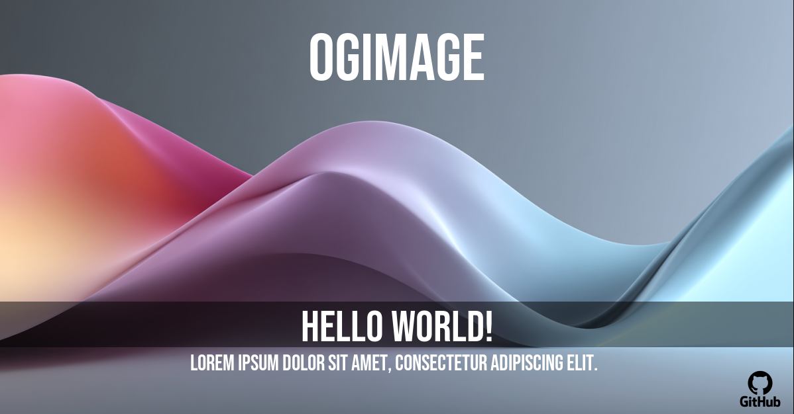
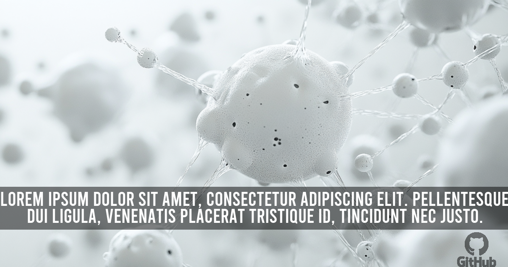
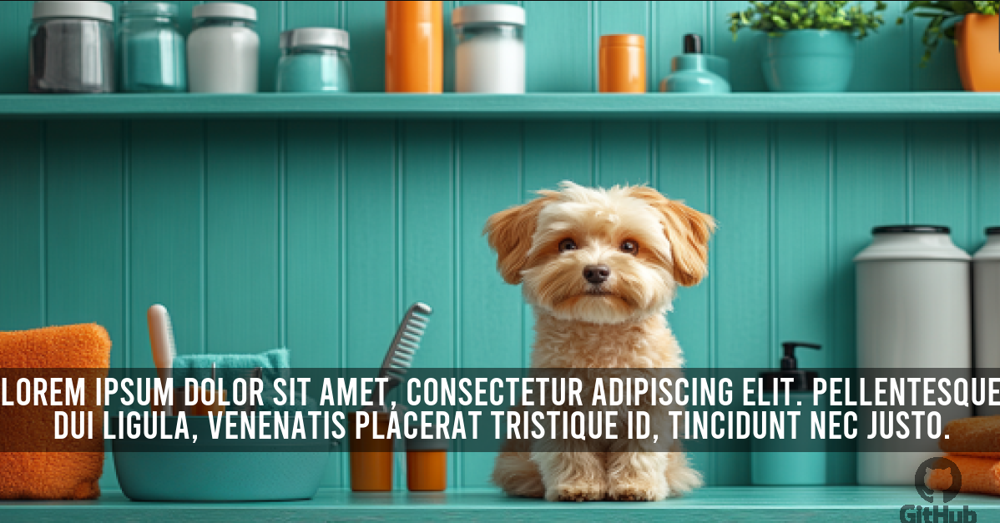
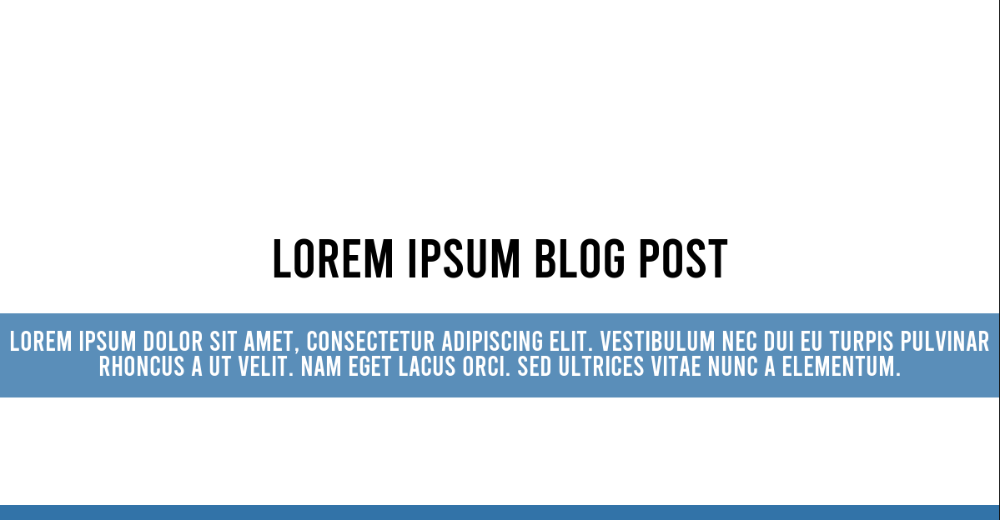

# OG Image Generator in PHP 1.2.1 (GD Driver)
    


### NOTE: This project is still in development.

---

A simple and flexible PHP library for generating Open Graph (OG) (but really any type of) images with customizable backgrounds, text, and watermarks. 
Perfect for creating dynamic social media preview images for your website or application.

This project was inspired by my clients, each of them wanted to have a custom OG image for their website.
One wanted to have a simple image with a quote, another wanted to have an avatar of the user displayed and so on.
While there are projects like that and don't get me wrong, they are great, but they are not flexible enough for my needs.

On the other hand, Imagine/Imagine is a great library, but it has a bit of code to write to get the desired result.

say, watermark, for example, you have to write a bit of code to get the desired result.

```php
$watermark = $imagine->open('/my/watermark.png');
$image     = $imagine->open('/path/to/image.jpg');
$size      = $image->getSize();
$wSize     = $watermark->getSize();

$bottomRight = new Imagine\Image\Point($size->getWidth() - $wSize->getWidth(), $size->getHeight() - $wSize->getHeight());

$image->paste($watermark, $bottomRight);
```
It is simpler than native GD, but still.
I wanted it to be straightforward and simple, since I'm using it quite often.

```bash
createImage()
addWatermark(bottom,left)
addText('Hello World',center,center)
render()
```

Done.

---

## Example Image

### NOTE: all highlighted elements are separate layers, so you can easily customize them.



---

Image background with text and watermark.



---

Resized image background with text. (see original image [here](docs/images/background_small_original.png))



---

Image background with for quote.


---

Color background with borders and text.


### Fancy Memorial Example

There are 3 watermarks elements in this example: the logo, fancy frame and a portrait and 2 text elements: name and dates.


as used at [ForeverAfter.Life](https://foreverafter.life/liam-payne) - [OG](https://foreverafter.life/image/og/278258412528275.png) 


---

### Pre-defined template

Pre-defined templates are something that I'm working on right now.
The idea is to have a set of pre-defined templates that you can use to generate images.
Such as, for example, a blog post template, a quote template, a product template, user profile template and so on.




```php
$ogImageTemplate = new OgTemplate('blog');

// optionally set custom background either solid color or image
#$ogImageTemplate->template->background('/path/to/background.jpg');

$ogImageTemplate->template->title('Lorem Ipsum Blog post');
$ogImageTemplate->template->description('Lorem ipsum dolor sit amet, consectetur adipiscing elit. Vestibulum nec dui eu turpis pulvinar rhoncus a ut velit. Nam eget lacus orci. Sed ultrices vitae nunc a elementum.');
$ogImageTemplate->render();
```

---


## Table of Contents

- [Features](#features)
- [Requirements](#requirements)
- [Installation](#installation)
- [Usage](#usage)
  - [Basic Usage](#basic-usage)
  - [Setting Backgrounds](#setting-backgrounds)
    - [Solid Color Background](#solid-color-background)
    - [Image Background](#image-background)
    - [Adding Borders](#adding-borders)
  - [Adding Text](#adding-text)
    - [Text Positioning](#text-positioning)
    - [Text Styling](#text-styling)
    - [Background Rectangle for Text](#background-for-text)
  - [Adding Watermarks](#adding-watermarks)
  - [Full Example](#full-example)
- [Customization](#customization)
  - [Fonts](#fonts)
  - [Padding and Alignment](#padding-and-alignment)
- [License](#license)

## Features

- Generate OG images with custom dimensions.
- Set backgrounds using solid colors or images.
- Add borders to the background.
- Add text with customizable font, size, color, and alignment.
- Wrap text automatically within a specified width.
- Add background rectangles behind text with adjustable opacity and padding.
- Include watermarks with adjustable size, position, and opacity.

## Requirements

- PHP 8.2.
- Composer.
- GD library installed and enabled.

## Installation

1. Install the library using Composer:

   ```bash
   composer require 53ny4/og-image
   ```

2. **Clone the Repository:**

   ```bash
   git clone https://github.com/53ny4/og-image.git
   ```

3. **Install Dependencies:**

   Navigate to the project directory and install the required packages using Composer.

   ```bash
   cd og-image
   composer install
   ```

   Ensure that the [imagine/imagine](https://github.com/php-imagine/Imagine) package is installed and available in the project.

---

**NOTE:** only GD driver is used. Make sure that the GD library is installed and enabled in your PHP configuration.

---
## Usage

### Basic Usage

Here's a quick example of how to generate an OG image with a solid color background, border, watermark and custom text.

```php
<?php

require 'vendor/autoload.php';

use s3ny4\OgImage\OgImage;
use s3ny4\OgImage\OgBackground;
use s3ny4\OgImage\OgText;
use s3ny4\OgImage\OgWatermark;

// Create a new OgImage instance
$ogImage = new OgImage();

// Set background (solid color)
$ogBackground = new OgBackground('#ffffff'); // White background
$ogBackground->addBorder('bottom', 10, '#ff0000');  // 10px red border at the bottom
$ogBackground->addBorder('top', 10, '#00ff00');  // 10px green border at the top
$ogBackground->addBorder('left', 10, '#0000ff');  // 10px blue border at the left
$ogBackground->addBorder('right', 10, '#ffff00');  // 10px yellow border at the right

$ogImage->setBackground($ogBackground); // Set the background


// Add text
$ogText = new OgText();
$ogText->setText('Hello World!');
$ogText->setPosition('center', 'center');
$ogText->setColor('000000'); // Black text
$ogText->setSize(60);
$ogImage->addText($ogText); // Add the text to the image

$ogWatermark = new OgWatermark();
$ogWatermark->image('/path/to/watermark.png');
$ogWatermark->setPosition('right', 'bottom'); // Bottom right corner; x - left, right, center; y - top, bottom, center
$ogWatermark->setSize(100); // Width of 100 pixels
$ogWatermark->setOpacity(50); // 50% opacity
$ogImage->addWatermark($ogWatermark); // Add the watermark to the image

// Render and output the image
$ogImage->render(); // Output to browser
```

### Setting Backgrounds

You can set the background of the image using a solid color or an image.

#### Solid Color Background

```php
$ogBackground = new OgBackground('#ff0000'); // Red background
$ogImage->setBackground($ogBackground);
```

#### Image Background

```php
$ogBackground = new OgBackground('/path/to/background.jpg');
$ogImage->setBackground($ogBackground);
```

#### Adding Borders

You can add borders to the background with custom width and color.

```php
$ogBackground->addBorder('bottom', 10, '#ff0000'); // 10px red border at the bottom
$ogBackground->addBorder('top', 10, '#00ff00'); // 10px green border at the top
$ogBackground->addBorder('left', 10, '#0000ff'); // 10px blue border at the left
$ogBackground->addBorder('right', 10, '#ffff00'); // 10px yellow border at the right
```

### Adding Text

You can add multiple text elements to the image, each with its own styling and positioning.

#### Text Positioning

Position the text horizontally (`'left'`, `'center'`, `'right'`) and vertically (`'top'`, `'center'`, `'bottom'`).

Hint: you can use pixel values for custom positioning.

```php
$ogText->setPosition('center', 'bottom');
```

#### Text Styling

Customize the text color, size, and font.

```php
$ogText->setColor('#ffffff'); // White text (# hashtag is optional)
$ogText->setSize(50); // Font size 50
$ogText->setFontFile('/path/to/font.ttf'); // Custom font
```

#### Background for Text

Add a background rectangle behind the text with adjustable opacity.

```php
$ogText->setBackground('000000', 80); // Black background with 80% opacity
```

### Adding Watermarks

Add watermark image with customizable size, position, and opacity. (can be added multiple watermarks)
Watermark treated as a separate layer, so you can add multiple watermarks and they can overlap each other.

Hint: watermark can be not only used as an actual watermark, but also as a logo or any other image. Also: you can use pixel values for custom positioning.

```php
use s3ny4\OgImage\OgWatermark;

// Create a new OgWatermark instance
$ogWatermark = new OgWatermark();
$ogWatermark->image('/path/to/watermark.png');
$ogWatermark->setPosition('right', 'bottom'); // Bottom right corner; x - left, right, center; y - top, bottom, center
$ogWatermark->setSize(100); // Width of 100 pixels
$ogWatermark->setOpacity(50); // 50% opacity

$ogImage->addWatermark($ogWatermark);
```

### Full Example

Putting it all together:

```php
<?php

require 'vendor/autoload.php';

use s3ny4\OgImage\OgImage;
use s3ny4\OgImage\OgBackground;
use s3ny4\OgImage\OgText;
use s3ny4\OgImage\OgWatermark;

// Create a new OgImage instance
$ogImage = new OgImage(1200, 630); // Custom dimensions

// Set background (image)
$ogBackground = new OgBackground('/path/to/background.jpg'); # Image background

// Set background (solid color)
// $ogBackground = new OgBackground('#ff0000'); # Red background

$ogImage->setBackground($ogBackground); # Set the background

// Add text
$ogText = new OgText();
$ogText->setText('Your Custom OG Image'); # Text
$ogText->setPosition('center', 'center'); # x - left, right, center; y - top, bottom, center
$ogText->setColor('#ffffff'); # Text color
$ogText->setSize(60); # Font size
$ogText->setBackground('000000', 50); // Semi-transparent black background
$ogText->setPadding(20); # Padding around the text
$ogImage->addText($ogText); # Add the text to the image

// Add watermark
$ogWatermark = new OgWatermark();
$ogWatermark->image('/path/to/watermark.png'); # Watermark image
$ogWatermark->setPosition('right', 'bottom'); # x - left, right, center; y - top, bottom, center
$ogWatermark->setSize(100); # Width of 100 pixels
$ogWatermark->setOpacity(80); # 80% opacity
$ogImage->addWatermark($ogWatermark); # Add the watermark to the image

// output to browser
$ogImage->render();

//or
    
// Render and output the image
// $ogImage->render('output.png');
```

## Customization

### Fonts

- **Default Font:** The library comes with a default font located in `src/assets/fonts/`.
- **Custom Fonts:** Use the `setFontFile` method to specify a custom font file.

  ```php
  $ogText->setFontFile('/path/to/custom-font.ttf');
  ```

### Padding and Alignment

- **Vertical Padding:** Adjust the vertical padding around the text using `setPadding`.

  ```php
  $ogText->setPadding(30); // 30 pixels of vertical padding
  ```

- **Text Alignment:** Control the horizontal alignment (`'left'`, `'center'`, `'right'`) and vertical alignment (`'top'`, `'center'`, `'bottom'`).

  ```php
  $ogText->setPosition('left', 'top');
  ```

- **Text Wrapping:** Set a maximum width for text wrapping using `setMaxWidth`.

  ```php
  $ogText->setMaxWidth(800); // Wrap text at 800 pixels
  ```

---

**Note:** Ensure all file paths are correct and that necessary assets (fonts, images) are available in the specified locations. Adjust permissions as needed to allow the script to read and write files.

**Disclaimer:** This library uses the GD library for image manipulation.

## License

This project is licensed under the [MIT License](https://opensource.org/license/mit)

---