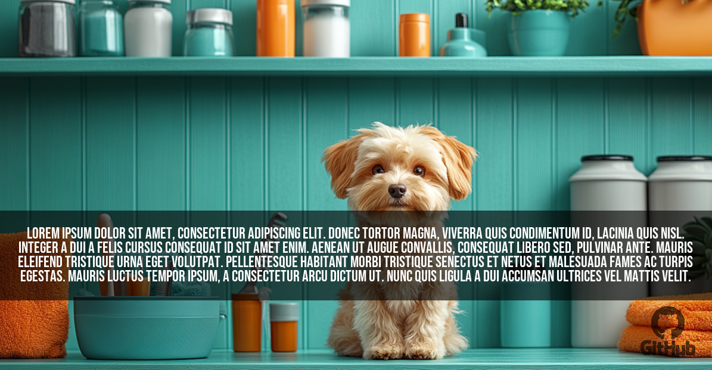

# OgImage v0.4.0

`OgImage` is a simple PHP class that generates Open Graph (OG) images dynamically using the Imagine library for image manipulation. It allows for customizing background colors or images, adding overlay text with adjustable styles, and setting various image dimensions.

### NOTE: This project is still under development and may have breaking changes in the future.

## Features

- **Customizable background**: Set a solid color or provide a background image. Image will be resized to fit the OG area.
- **Overlay text**: Add text with adjustable font size, color, and background color.
- **Automatic font size adjustment**: Dynamically resizes text to fit within the text area.
- **Flexible image size**: Customize the image width and height to suit your needs.
- **Text position**: Set the position of the overlay text on the image.
- **Font size**: Set the font size of the overlay text.
- **Watermark**: Add a watermark to the image with a custom position and opacity.


## Todo
- [ ] more human-readable text position
- [x] more human-readable watermark position
- [ ] custom text background opacity


## Example image



## Installation

Install via Composer:

```bash
composer require 53ny4/og-image
```

Ensure you have the [Imagine](https://github.com/php-imagine/Imagine) library installed, as it's required for image manipulation:

```bash
composer require imagine/imagine
```

## Usage

Here's a simple example of how to use the `OgImage` class to generate an image and show it in the browser:

```php
use s3ny4\OgImage\OgImage;

require_once __DIR__ . '/vendor/autoload.php';

$ogImage = new OgImage();
$ogImage->setText('Lorem ipsum dolor sit amet, consectetur adipiscing elit. Mauris sed fringilla leo.') # Set the text to be overlaid on the image
    ->setTextColor('#FFFFFF') # Set the color of the overlay text
    ->setTextBackgroundColor('#000000') # Set the background color behind the text
    ->setBackground('', __DIR__ . '/assets/images/background.jpg') # Set the background of the image, either as a color or from an image path
    # OR
    # ->setBackground('#000000') # Set the background of the image, either as a color or from an image path
    ->setFontSize(20) # Set the font size of the overlay text
    ->setTextPosition(['x' => 0, 'y' => -150]) # Set the position of the overlay text
    ->setFontPath(__DIR__ . '/assets/fonts/Roboto-Regular.ttf') # Set the font path for the text overlay
    ->setWatermark([
        'path' => __DIR__ . '/assets/images/github_logo.png', # Path to the watermark image
        'scale' => 150, # Scale of the watermark image (pixels)
        'position' => ['x' => 'center', 'y' => 'center'], # place the watermark in the center
        #'position' => ['x' => 1050, 'y' => 520], # Position of the watermark image
        'opacity' => 60 # Opacity of the watermark image
    ])
    ->generate() # Generate the final image
    ->show('png'); # Show the final image in the browser
``` 


### Methods

- `setText(string $text)`: Sets the text to be overlaid on the image.
- `setTextColor(string $textColor)`: Sets the color of the overlay text.
- `setTextBackgroundColor(string $textBackgroundColor)`: Sets the background color behind the text.
- `setBackground(string $color = '', string $image = '')`: Sets the background of the image, either as a color or from an image path.
- `setWidth(int $width)`: Sets the width of the image. Default is 1200.
- `setHeight(int $height)`: Sets the height of the image. Default is 630.
- `generate()`: Generates the final image and returns it as an `ImageInterface` then it can be saved `->save()` or shown `->show()`.
- `setFontPath(string $fontPath)`: Sets the font path for the text overlay.
- `setFontSize(int $fontSize)`: Sets the font size of the overlay text.
- `setTextPosition(array $position)`: Sets the position of the overlay text.
- `setWatermark(array $watermark)`: Sets the watermark image on the image.
   - `path`: Path to the watermark image.
   - `position`: Position of the watermark image. (x = 'center', 'left', 'right', y = 'center', 'top', 'bottom')
   - `opacity`: Opacity of the watermark image.
   - `scale`: Scale of the watermark image (pixels).

## License

This project is licensed under the MIT License. See the [LICENSE](https://opensource.org/license/mit) file for more details.

## Dependencies

- [Imagine Library](https://github.com/avalanche123/Imagine)

## Contributing

Contributions are welcome! Feel free to submit a pull request or open an issue for any bug fixes or improvements.